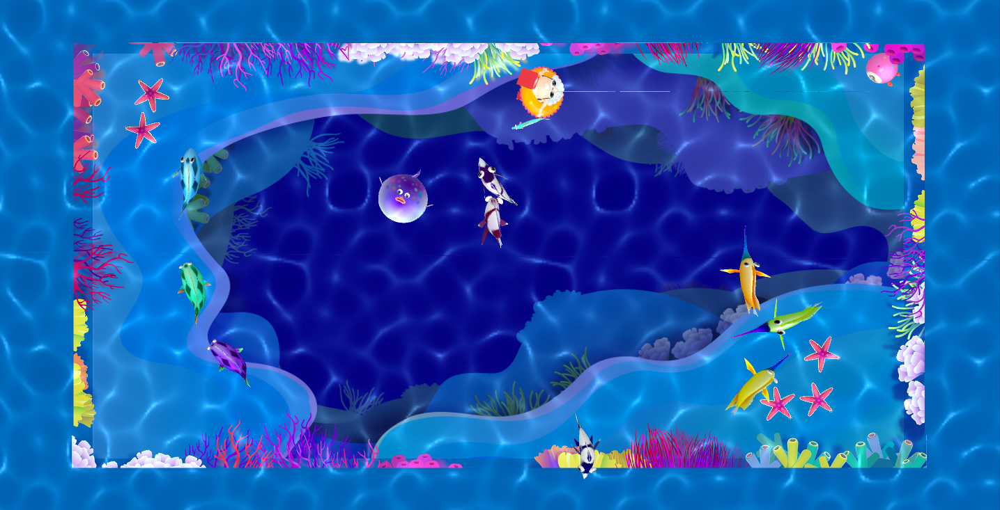
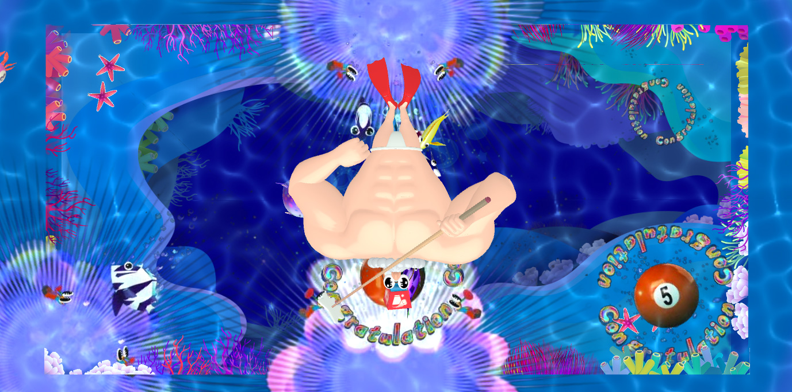
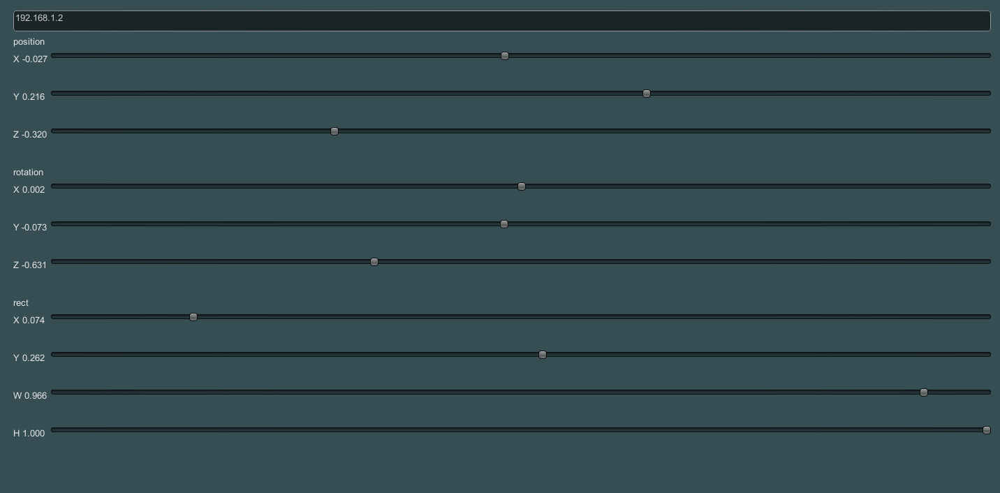

unity module for opennpool-core-unity
===================

# UnityModule/OpenPool

プロジェクト構成

- Assets
	- _SeaSaw : 今回のサンプルエフェクト
	- Editor : 編集のみで使う
	- OpenPool : OpenPoolコア
	- Plugins : プラグイン
	- UnitySteer : _SeaSaw使用ライブラリ	

### サンプルの確認

	_SeaSaw/Scenes/SeaSaw.unity

を開くとサンプルが確認出来ます。

### オリジナルのエフェクトを作る

1. シーンに一つ、OpenPoolManagerを置いてください。

		Assets/OpenPool/Resources/Prefabs/OpenPoolManager.prefab
2. PoolTableの状態はc#のイベントとして通知されます。
	- いくつかの汎用的なエフェクトは /OpenPool/Scripts/Components/Effect/*にあります。
	- 一番シンプルなサンプルは CollisoinEffect.cs です。
				
			protected override void Initialize ()
			{	
				manager.collisionTracker.OnCollision += OnCollision;
			}
			
			void OnCollision (float level) {
				// play effects
			}
	- ボールの位置
		
			BallTracker = OpenPoolManager.instance.ballTracker;
			void Update() {				
				BallTracker.Ball[] balls = ballTracker.ballList;
				
				// play effects				
			}
	
	- ポケットイン
	
			protected override void Initialize ()
			{
				manager.instance.pocketTracker.OnPocket += OnPocket;
			}
			
			void OnPocket (int pocketID, int ballID) {
				// play effects
			}
	
	- コリジョン
			
			protected override void Initialize ()
			{
				manager.collisionTracker.OnCollision += OnCollision;
			}
			
			void OnCollision (float level) {
				// play effects
			}
	
	- キャリブレーション
			
			protected override void Initialize ()
			{
				manager.calibrationTraker.OnChange += OnCalibrationChange;
			}
			
			void OnCalibrationChange (Vector3 pos, Vector3 rot, Rect rect)
			{
				// calibration
			}

#### 動作環境

- Unity 4.5.0

#### 使用ライブラリ
- [JsonSplitSprite](https://gist.github.com/tsubaki/7500360)   
- [MiniJSON](https://gist.github.com/darktable/1411710)
- [UnitySteer](https://github.com/ricardojmendez/UnitySteer)
- [OSC from reacTIVision](http://reactivision.sourceforge.net/)

#### ライセンス

２つのライセンスが下記の通り適用されます。
- UnityModule/OpenPool/Assets/_SeaSaw : CreativeCommons CC-BY-NC-SA. 
- UnityModule/OpenPool/ 内のその他のファイル : GPL ver3. 

詳細は [LICENSE.md](./OpenPool/LICENSE.md) をご覧下さい。

===================
# UnityModule/OscTest

OSC通信部分のテストコードです。Pythonの実行環境が必要です。  

Unityアプリを実行した状態で、コマンドを実行します。

	cd PathToOSCTest/  
	python OscTest.py
	# python OscTest.py 127.0.0.1 # change ip address

#### 使用ライブラリ

- [SimpleOSC](http://www.ixi-audio.net/content/body_backyard_python.html)

#### ライセンス
GPL ver3. 
See [LICENSE.md](./OscTest/LICENSE.md)

===================
# UnityModule/Controller

投影した時に、投影位置を調整するキャリブレーション用のライブラリです。

指定したipアドレスのUnityカメラの

- ポジション (X,Y,Z)
- 回転 (X,Y,Z)
- トリム (X,Y,W,H)

を指定します。

#### 使用ライブラリ

- [LitJson](https://github.com/lbv/litjson)

#### ライセンス
GPL ver3. 
See [LICENSE.md](./Controller/LICENSE.md)

